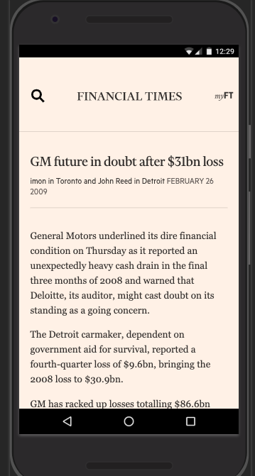
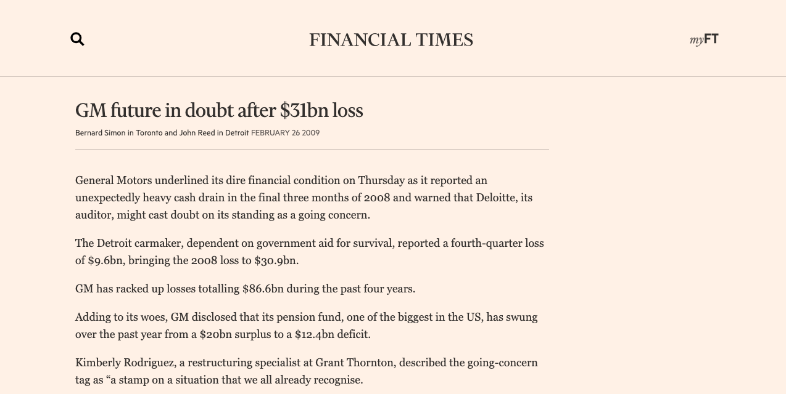
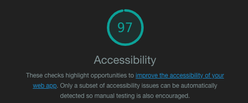
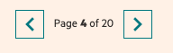
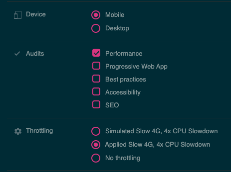
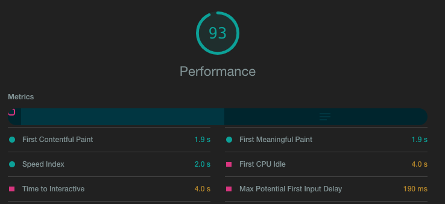

# Documentation

## Responsive

- Media queries were used to set responsive design.

- We only use a basic responsive screen.

- Supports tablets screen size and over, so over 728 pixel of width screen we change our layout.

- Origami components were added and they support responsive too.

### Mobile layout 

Lateral espaces were added beetwen body content and screen extremes, to get a result like this: 


```| <--> | BODY | <-------> |```


### CSS code
```css

// see style.css file

@media screen and (min-width: 768px) {}
```

Mobile version

### Mobile screen


### Table - Desktop +


## Accesibility

- To test our acessibility we use Chrome audit dev tools. This a first way to test.
- Semantic tags were used and lang attribute lang.
  ```html
  <article>, <header>, <title>
  ```

- Keyboard navigation works pretty well.

### Chrome audit results:




## Pagination

- Basically pagination get the page asked by the user in the url (query param)
- When we get the total articles of results we use our utils function to get the maximum pages that we can get if we display 25 articles by page. 

```javascript
utils.getNumberOfPages(totalArticles, MAX_ARTICLES_BY_PAGE);
```

- We bloque pagination for extrems pages, for the page 1 we don't get show PREVIOUS button and in the last page we don't show NEXT button

- We use origami the buttons



## Origami and FT Style

Components used

- o-grid
- o-typography
- o-header
- o-forms
- o-buttons
- o-editorial-typography
- o-footer
- o-fonts
- o-teaser-collection
- o-teaser
- o-icons

Implemented in header html
```html
 <link rel="stylesheet" href="https://www.ft.com/__origami/service/build/v2/bundles/css?modules=o-grid@^5.0.2,
    o-typography@^6.1.3,o-header@^8.0.2,o-forms@^8.1.13,o-buttons@^6.0.9,o-editorial-typography@^1.0.4,o-footer@^7.0.2,o-fonts@^4.0.2,
    o-teaser-collection@^3.0.1,o-teaser@^4.0.1,o-icons@^6.0.2" onload="this.media='all'"/>
```

## Progressive enhancement

To be honest before this task/test i didn't knew about this practice. 

I will explain my approch/setps of this work.

- First i created content page, create routes, basic html/css
- Again, list search article page with basic html/css
- Add pagination
- Add search forms and manage data request to FT API for the search results
- Add FT style with Origami components and inspecting source code to get some CSS rules.
- Set mobile first to mobile screen
- Adapt CSS (media queries) to tablets/desktop + screens + viewport

## Performance 3G

## Imp


Paragraphs splitted 
Footer stick bottom

## Performance low network (3G)

- Chrome audit was used to improve the performance for slow network

### Settings



### Results 




- Improve load static file with async loading (onload)

```html
<link rel="stylesheet" onload="this.media='all'" />
```

- Also remove some unused libraries/files like fontawesome

## Offine

I could not implement this feature. 

I only could see that there are solutions like HTML5 feature and Service workers
